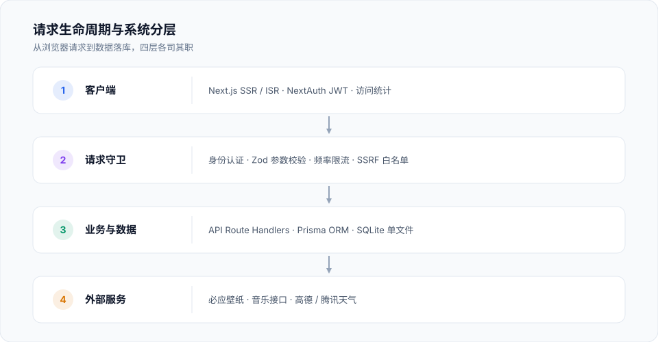

<div align="center">

# 栖云 · Qiyun

**栖息于云端，构建你的数字空间。**

Next.js 15 + TypeScript + Tailwind CSS + Prisma 的个人主页 / 导航首页<br>
可视化后台开箱即配 · SQLite 单文件存储 · Docker 一条命令部署 · 推送自动发版

[](https://github.com/sxlb/qiyun/releases)

[](https://nextjs.org)
[](https://www.typescriptlang.org)
[](https://www.prisma.io)


[部署教程](docs/deploy-1panel.md) · [变更日志](CHANGELOG.md) · [字体许可](FONT_LICENSES.md)

</div>

## 简介

栖云是一套开箱即用的个人主页 / 导航首页。前台是一个可自由定制的展示页——动态壁纸、时钟天气、导航链接、作品集、音乐播放器都在同一个页面里；后台则把这些配置全部可视化，换壁纸、加链接、调文案都不需要改代码。

数据存放在单个 SQLite 文件里，没有外部依赖，配合 Docker 一条命令即可部署到自己的服务器。

## 功能亮点

| 模块 | 能力 |
|------|------|
| **前台展示** | 动态壁纸（必应 / 动漫 / 风景）、时钟天气、导航链接、作品集、技能云、氛围特效、全局命令面板 |
| **内容互动** | 音乐播放器（Meting / QQ 音乐）、站点公告、访问统计与链接点击埋点 |
| **后台管理** | 站点信息、主题壁纸、音乐、社交链接、友情链接、作品集、技能云、天气设置，全站可视化配置 |
| **安全运维** | TOTP 二次验证、全 API Zod 校验、SSRF 防护、CSP 响应头、操作审计、备份导入导出 |

## 快速开始

### 服务器部署

```bash
./deploy.sh latest        # 拉取 GHCR 镜像并启动
```

首次运行会自动生成 `.env.deploy` 与随机密钥，容器启动时自动执行数据库迁移与 seed。
详见 → [宝塔 / 1Panel 部署教程](docs/deploy-1panel.md)

### 本地开发

```bash
npm install
cp .env.example .env
npx prisma migrate deploy
node prisma/seed.js
npm run dev
```

| 入口 | 地址 |
|------|------|
| 前台 | http://localhost:3000 |
| 后台 | http://localhost:3000/admin |
| 默认账号 | `admin / 123456`（首次登录后请立即修改） |

## 系统架构



> 客户端请求经 App Router 分发到各 API 路由，依次通过身份认证 → Zod 参数校验 → 频率限流 → SSRF 白名单，最终由 Prisma ORM 读写 SQLite，或代理请求第三方服务。

## 技术栈

| 领域 | 选型 |
|------|------|
| 框架 | Next.js 15（App Router / Standalone） |
| 语言 | TypeScript 5.7 · React 19 |
| 样式 | Tailwind CSS 3.4 · shadcn/ui |
| 数据库 | SQLite + Prisma 5.22 ORM |
| 认证 | NextAuth v4 + JWT + TOTP 二次验证 |
| 校验 | Zod（全 API 入参校验） |
| 测试 | Vitest · 59 个文件 / 547 个用例 |
| 交付 | Docker · GitHub Actions 构建并推送 GHCR |

## 项目结构

```
├── app/                  # 路由与页面（App Router）
│   ├── api/              # API 路由（认证 / 配置 / 壁纸 / 音乐 / 天气 / 统计 / 更新）
│   ├── admin/            # 后台管理
│   └── page.tsx          # 首页
├── components/           # UI 组件（前台组件 + admin 后台面板）
├── lib/                  # 核心逻辑（auth / ssrf / validation / backup / update）
├── docs/                 # 部署教程与架构图
├── prisma/               # Schema、48 个迁移、seed
├── public/fonts/         # 自托管字体
├── scripts/              # 宿主机更新执行器
├── tests/                # Vitest 测试（59 个文件 / 547 个用例）
├── .github/workflows/    # CI/CD 自动发版
└── deploy.sh · Dockerfile · docker-compose.yml
```

## 相关文档

| 文档 | 说明 |
|------|------|
| [部署教程](docs/deploy-1panel.md) | 宝塔 / 1Panel 服务器部署步骤 |
| [变更日志](CHANGELOG.md) | 每个版本的用户可感知变化 |
| [字体许可](FONT_LICENSES.md) | 自托管字体来源与授权 |

## 许可

保留作者版权信息，未经授权请勿整站抄袭。
