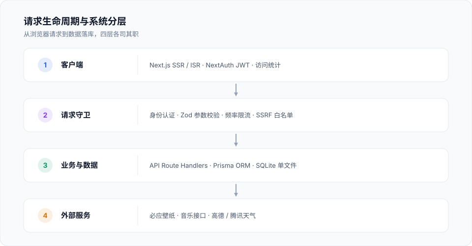

<div align="center">

# 栖云 · Qiyun

**栖息于云端，构建你的数字空间。**

Next.js 16 + TypeScript + Tailwind CSS + Prisma 的个人主页 / 导航首页<br>
可视化后台开箱即配 · SQLite 单文件存储 · Docker 一条命令部署 · 推送自动发版

[](https://github.com/sxlb/qiyun/releases)

[](https://nextjs.org)
[](https://www.typescriptlang.org)
[](https://www.prisma.io)


[部署教程](docs/deploy-1panel.md) · [API 文档](docs/API.md) · [变更日志](CHANGELOG.md) · [字体许可](docs/font-licenses.md)

</div>

## 简介

栖云是一套开箱即用的个人主页与导航首页。前台把动态壁纸、时钟天气、导航链接、作品集、音乐播放器收在同一个页面里；后台把这些配置全部可视化，换壁纸、加链接、调文案都不需要改代码。

数据存放在单个 SQLite 文件里，没有外部依赖，配合 Docker 一条命令即可部署到自己的服务器，后台还能一键升级或回滚版本。

## 功能亮点

| 模块 | 能力 |
|------|------|
| **前台展示** | 动态壁纸（必应 / 动漫 / 风景 / 自定义）、时钟天气胶囊、一言、导航链接、作品集、技能云、季节装饰与点击特效、全局命令面板（Ctrl/Cmd+K） |
| **内容互动** | 音乐播放器（三套面板风格、顶部进度条与悬浮歌词）、站点公告、访问统计与链接点击埋点 |
| **后台管理** | 站点信息与功能开关、主题壁纸、音乐、社交 / 网站 / 友情链接、作品集、技能云、站点公告、媒体库，第三方服务与天气数据源均可换源 |
| **运维与安全** | TOTP 两步验证、登录限流与锁定、全 API Zod 校验、SSRF 防护、CSP 响应头、操作审计、备份导入导出、在线更新与版本回滚（多架构镜像，x86_64 与 ARM 服务器通用） |

## 快速开始

### 服务器部署

从 [Releases](https://github.com/sxlb/qiyun/releases/latest) 下载 `qiyun-<版本号>.tar.gz`，上传到服务器后解压启动：

```bash
tar -xzf qiyun-0.0.18.tar.gz -C /opt
cd /opt/qiyun
./deploy.sh               # 自动拉取镜像、生成密钥并启动
```

首次运行会自动生成 `.env.deploy`，容器启动时自动执行数据库迁移与 seed。完整步骤见 [宝塔 / 1Panel 部署教程](docs/deploy-1panel.md)。

如需使用后台的「一键更新 / 回滚」，部署后在服务器上执行一次 `sudo bash scripts/setup-update.sh` 启用更新通道；不启用也可以用 `./deploy.sh <版本号>` 手动升级。

### 本地开发

```bash
npm install
cp .env.example .env
npx prisma migrate deploy
node prisma/seed.js
npm run dev
```

| 入口 | 地址 |
|------|------|
| 前台 | http://localhost:3000 |
| 后台 | http://localhost:3000/admin |
| 默认账号 | `admin / 123456`（首次登录后请立即修改） |

## 系统架构



> 客户端请求经 App Router 分发到各 API 路由，依次通过身份认证 → Zod 参数校验 → 频率限流 → SSRF 白名单，最终由 Prisma ORM 读写 SQLite，或代理请求第三方服务。

## 技术栈

| 领域 | 选型 |
|------|------|
| 框架 | Next.js 16（App Router / Turbopack / Standalone） |
| 语言 | TypeScript 5.7 · React 19 |
| 样式 | Tailwind CSS 3.4 · shadcn/ui |
| 数据库 | SQLite + Prisma 5.22 ORM |
| 认证 | NextAuth v4 + JWT + TOTP 二次验证 |
| 校验 | Zod（全 API 入参校验） |
| 测试 | Vitest · 73 个文件 / 687 个用例 |
| 交付 | Docker · GitHub Actions 构建并推送 GHCR |

## 项目结构

```
├── app/                  # 路由与页面（App Router）
│   ├── api/              # API 路由（认证 / 配置 / 壁纸 / 音乐 / 天气 / 统计 / 更新）
│   ├── admin/            # 后台管理
│   └── page.tsx          # 首页
├── components/           # UI 组件
│   ├── home/             # 前台组件（首页与装饰效果）
│   ├── admin/            # 后台面板
│   └── ui/               # 基础组件（shadcn）
├── hooks/                # React 自定义 Hook
├── lib/                  # 核心逻辑（auth / ssrf / validation / backup / update）
├── docs/                 # 部署、发布、API、许可等文档
├── prisma/               # Schema、55 个迁移、seed
├── public/fonts/         # 自托管字体
├── scripts/              # 宿主机更新执行器
├── tests/                # Vitest 测试（73 个文件 / 687 个用例）
│   ├── lib/              # 被测模块在 lib/
│   ├── components/       # 被测模块在 components/
│   ├── hooks/            # 被测模块在 hooks/
│   └── app/              # 被测对象是页面或路由
├── .github/workflows/    # CI/CD 自动发版
├── next.config.ts · tsconfig.json · tailwind.config.ts · postcss.config.mjs
│   eslint.config.mjs · vitest.config.ts   # 工具链配置，均为框架约定的根目录位置
└── deploy.sh · Dockerfile · docker-compose.yml · .env.deploy.example
```

## 常用配置

部署变量写在 `.env.deploy`，带注释的完整模板见 [`.env.deploy.example`](.env.deploy.example)。

| 变量 | 说明 |
|------|------|
| `NEXTAUTH_SECRET` | 会话签名密钥，需 ≥ 32 字符。保留占位值时由 `deploy.sh` 自动生成 |
| `BACKUP_HMAC_KEY` | 备份签名密钥。缺失会导致导出 / 恢复备份直接失败 |
| `NEXTAUTH_URL` | 站点完整访问地址。域名部署时必须改为 `https://你的域名`，否则登录后会跳回登录页 |
| `SEED_ADMIN_PASSWORD` | 后台初始密码（≥ 8 位）。不设置时固定为 `123456`，仅首次建库生效 |
| `VISIT_RECORD_RETENTION_DAYS` | 访问明细保留天数，默认 180，填 `0` 表示永久保留 |

## 相关文档

| 文档 | 说明 |
|------|------|
| [部署教程](docs/deploy-1panel.md) | 宝塔 / 1Panel 服务器部署步骤 |
| [发布流程](docs/releasing.md) | 版本号规则、发布产物与两条硬约束（维护者用） |
| [API 文档](docs/API.md) | 全部接口的入参、响应与鉴权要求 |
| [变更日志](CHANGELOG.md) | 每个版本的用户可感知变化 |
| [字体许可](docs/font-licenses.md) | 自托管字体来源与授权 |

## 许可

本项目基于 GNU Affero General Public License v3.0 或更新版本开源，Copyright (C) 2026 sxlb，完整条款见 [LICENSE](LICENSE)。

你可以自由使用、修改并分发本项目，包括商用；改动后的版本如果通过网络对外提供服务，就必须向使用者公开完整的对应源码。原样部署不作修改的，无需公开任何内容。仓库内自托管的字体不适用本协议，各自遵循上游授权，详见 [字体许可](docs/font-licenses.md)。
